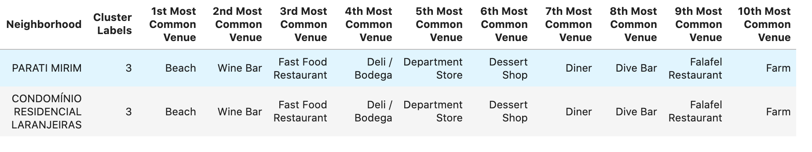

---
output:
  xaringan::moon_reader:
    seal: false
    lib_dir: libs
    css: ["default", "rladies-fonts", "resources/css/progress.css", "resources/css/adds.css"]
    nature:
      ratio: "16:9"
      highlightStyle: github
      highlightLines: true
      countIncrementalSlides: false
      slideNumberFormat: |
        <div class="progress-bar-container">
          <div class="progress-bar" style="width: calc(%current% / %total% * 100%);">
          </div>
        </div>
---

```{r setup, include=FALSE}

knitr::opts_chunk$set(message = FALSE, warning = FALSE, fig.retina = 3)

```

class: inverse, left, middle

background-image: url(resources/images/cover.gif)
background-size: cover

# Battle of Neighborhoods


.large[Coursera Capstone Project | Thiago Pires]

---
layout: true

background-image: url(resources/images/coursera-logo.png)
background-position: 97% 3%
background-size: 10%

---
# Introduction

**Rio de Janeiro** is recognized as a wonderful city and there are several attractions for tourists. The metropolitan area is usually selected as a major travel destination, however outside the capital there are interesting places to visit.

The purpose of this study is to select a location in the state of Rio de Janeiro in order to rent a vacation home. The main selected locations are not in the state capital, but include the region of the lakes (*Lagos*), mountains (*Serrana*) and *Bahia da Ilha Grande*.

---
# Data

Brazilian Institute of Geography and Statistics (IBGE in Portuguese) data were used to **identify spatial coordinates**. Foursquare data will also be used to **identify the main resources of cities**.

---
# Methodology

In order to segment the locations, **Kmeans** was used. An **unsupervised machine learning technique** that can help us verify what **similarities** exist between locations. The variables used to analyze the similarities of these regions were the **venues** extracted from the proximity with the spatial coordinates provided for each region.

---
# Results

The full list from regions to analysis is below

```{r out.height='80%', echo=FALSE, fig.align='center'}


```

---
# Results

Following is the map with all locations

```{r out.height='80%', echo=FALSE, fig.align='center'}


```

---
# Cluster neighborhoods

The map with all locations aggregated in clusters *pos* kmeans

```{r out.height='80%', echo=FALSE, fig.align='center'}


```

---
# Examine clusters

### Cluster 0

```{r out.height='80%', echo=FALSE, fig.align='center'}


```

---
# Examine clusters

### Cluster 1

```{r out.height='80%', echo=FALSE, fig.align='center'}


```

---
# Examine clusters

### Cluster 2 and 3

```{r out.height='80%', echo=FALSE, fig.align='center'}


```

```{r out.height='80%', echo=FALSE, fig.align='center'}



```

---
# Examine clusters

### Cluster 4 and 5

```{r out.height='80%', echo=FALSE, fig.align='center'}

knitr::include_graphics("resources/images/cluster4.png")

```

```{r out.height='80%', echo=FALSE, fig.align='center'}


```

---
# Examine clusters

### Cluster 6

```{r out.height='80%', echo=FALSE, fig.align='center'}


```

---
### Cluster 6 (continue)

```{r out.height='80%', echo=FALSE, fig.align='center'}


```

---
# Discussion

Seven clusters were selected. Clusters 1 and 6 are the ones that added more localities. They are clusters that concentrate the most visited cities in these selected regions.

### Cluster 1

- In Abraão there are a lot of options of **hotels ans hostels**, you can stay there by **little money**. There are also good beach options.
- Arraial do Cabo is a great place. There is wonderful beaches and there may be more cheaper than Cabo Frio and Búzios (nearby places).

Cluster 1 there are more locations near a beach and can be more cheaper than locations in cluster 6

---
# Discussion

### Cluster 6

- Paraty was interesting because it contains diverse places, such as: beach, historic places, bookstores.
- To get a european experience in Brazil, Petrópolis is a nice place to go. Chocolate shop and German Restaurante as main options.
- Cabo Frio and Búzios are great places, but they are very expensive.

Cluster 6 has higher cost locations, such as restaurants specializing in international dishes.

The other places, by the my experience look less interesting to visit.

---
# Conclusion

Really, Rio de Janeiro is an excellent place, with several options: from the beach or the mountains. There are places for all tastes. Even very interesting places you can spend a lot less money. 

---
class: center middle
background-color: #000000

[<font color="white">github.com/th1460/Coursera_Capstone</font>](https://github.com/th1460/Coursera_Capstone)


```